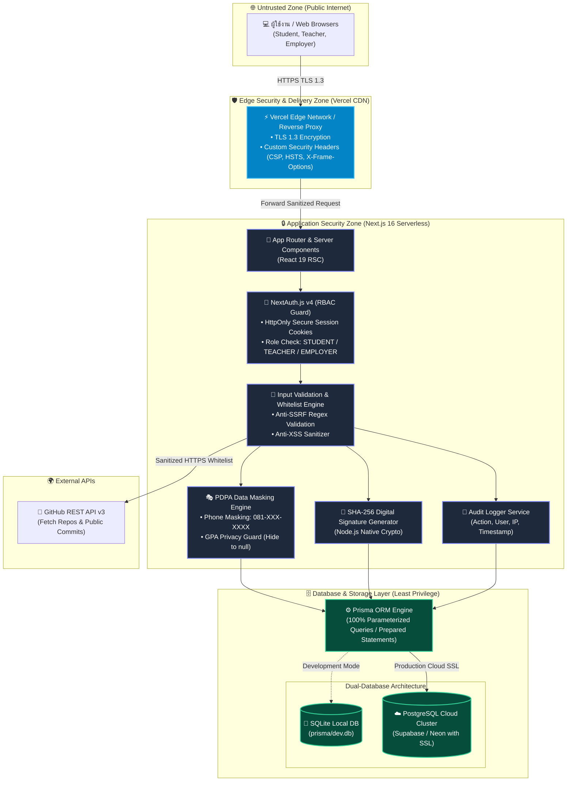
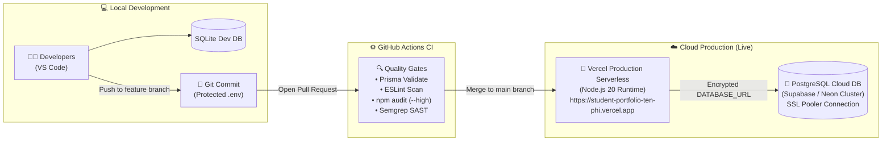
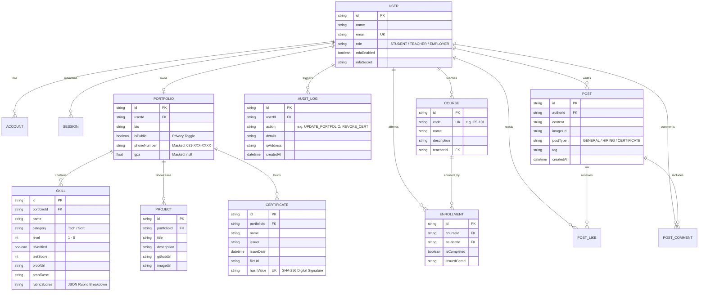

# 📐 สถาปัตยกรรมระบบและโครงสร้างฐานข้อมูล (System Architecture & ER Diagram)
## โครงงาน: Student Portfolio & Skill Passport (กลุ่มที่ 3 มสด.)

> เอกสารนี้จัดทำขึ้นเพื่อเป็นหลักฐานข้อ 6 (Architecture Diagram) และข้อ 7 (ER Diagram หรือ Database Schema) สำหรับส่งมอบ Final Project รายวิชา DevSecOps (100 คะแนน)

---

# 1. แผนภาพสถาปัตยกรรมระบบ (Architecture Diagram — สิ่งที่ต้องส่งข้อ 6)

### 1.1 สถาปัตยกรรมภาพรวมและขอบเขตความไว้วางใจ (System Architecture & Trust Boundaries)

---

### 1.2 แผนภาพสถาปัตยกรรมการ Deploy บน Cloud (Cloud Production Architecture)

---

# 2. แผนภาพโครงสร้างฐานข้อมูล (ER Diagram — สิ่งที่ต้องส่งข้อ 7)

### 2.1 Entity Relationship Diagram (Mermaid ERD)

---

### 2.2 สรุปการเชื่อมโยงความสัมพันธ์ของตารางฐานข้อมูล

| โมเดล (Table) | ความสัมพันธ์ (Relationship) | ความสำคัญด้านความมั่นคงปลอดภัย |
| :--- | :--- | :--- |
| **User** | 1:1 กับ `Portfolio`, 1:N กับ `AuditLog`, `Course`, `Post` | จัดการ Role-Based Access Control (RBAC) และบันทึกประวัติการใช้งาน |
| **Portfolio** | 1:1 กับ `User`, 1:N กับ `Skill`, `Project`, `Certificate` | จัดเก็บสถานะความเป็นส่วนตัว (`isPublic`) และฟิลด์คุ้มครอง PDPA (`phoneNumber`, `gpa`) |
| **Certificate** | N:1 กับ `Portfolio` | มีฟิลด์ `hashValue` (Unique SHA-256) ป้องกันการแก้ไขหรือปลอมแปลงใบประกาศนียบัตร |
| **Skill** | N:1 กับ `Portfolio` | มีฟิลด์ `rubricScores` และ `isVerified` ที่แก้ไขได้เฉพาะอาจารย์ผู้สอนเท่านั้น |
| **AuditLog** | N:1 กับ `User` (onDelete: SetNull) | ป้องกัน Log สูญหายแม้ผู้ใช้จะถูกลบ เพื่อความโปร่งใสและตรวจสอบย้อนกลับได้เสมอ |
| **Course & Enrollment**| 1:N ระหว่างอาจารย์กับรายวิชา, N:M กับนักศึกษา | ตรวจสอบสิทธิ์การออกใบประกาศนียบัตรเฉพาะนักศึกษาที่ลงทะเบียนจริง |
